# Countries Data

> ## Performance Profiling
>
> Profiling was performed using React DevTools Profiler.

> ## Tested interactions:
>
> Sorting a column  
> Searching for a country  
> Selecting a year  
> Adding/removing columns

## Before optimization

> ## Sorting a column(population):
>
> **Commit Duration:** 1.6s
> **Render Duration:** 102.9ms
> **Interactions:** Not recorded (Profiler did not capture explicit interactions, but commit and render times were analyzed instead)
>
> ### Screenshots:
>
> Flame Graph for sorting
> 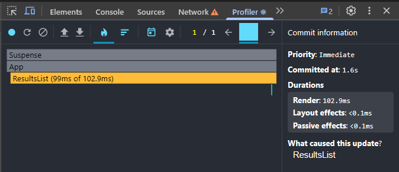
> Ranked Chart for sorting
> 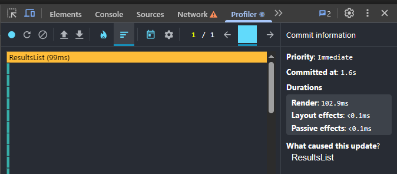

> ## Searching for a country:
>
> **Commit Duration:** 1.2s  
> **Render Duration:** 4.7ms  
> **Interactions:** Not recorded (Profiler did not capture explicit interactions, but commit and render times were analyzed instead)
>
> ### Screenshots:
>
> Flame Graph for search
> 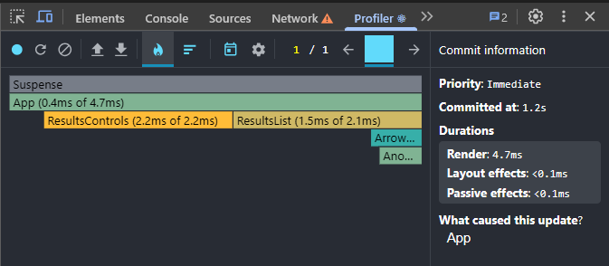
> Ranked Chart for search
> 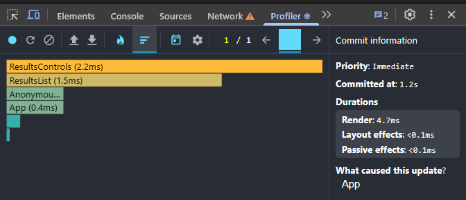

> ## Selecting a year:
>
> **Commit Duration:** 3.1s  
> **Render Duration:** 129.5ms  
> **Interactions:** Not recorded (Profiler did not capture explicit interactions, but commit and render times were analyzed instead)
>
> ### Screenshots:
>
> Flame Graph for year
> 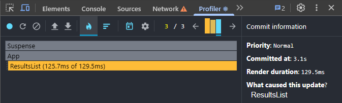
> Ranked Chart for year
> 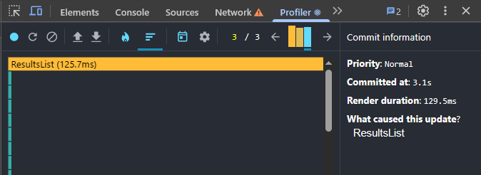

> ## Adding/removing columns:
>
> **Commit Duration:** 3.2s  
> **Render Duration:** 106.5ms  
> **Interactions:** Not recorded (Profiler did not capture explicit interactions, but commit and render times were analyzed instead)
>
> ### Screenshots:
>
> Flame Graph for columns
> 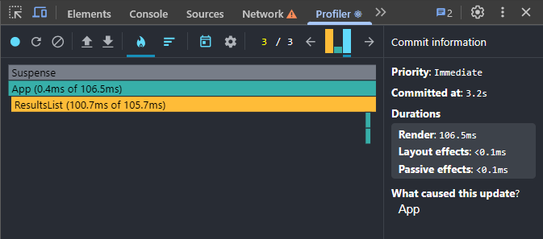
> Ranked Chart for columns
> 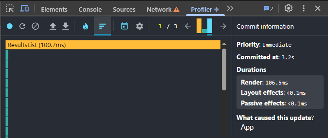

## After optimization

> ## Sorting a column(population):
>
> **Commit Duration:** 0.8s
> **Render Duration:** 135.1ms
> **Interactions:** Not recorded (Profiler did not capture explicit interactions, but commit and render times were analyzed instead)
>
> ### Screenshots:
>
> Flame Graph for sorting
> 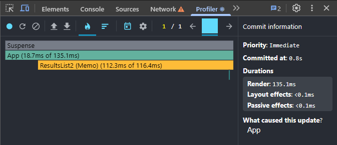
> Ranked Chart for sorting
> 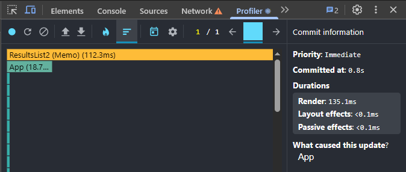

> ## Searching for a country:
>
> **Commit Duration:** 1.2s  
> **Render Duration:** 3.4ms  
> **Interactions:** Not recorded (Profiler did not capture explicit interactions, but commit and render times were analyzed instead)
>
> ### Screenshots:
>
> Flame Graph for search  
> 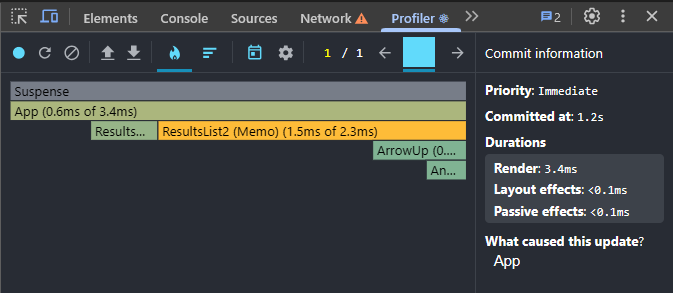
> Ranked Chart for search
> 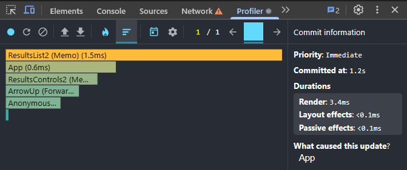

> ## Selecting a year:
>
> **Commit Duration:** 2.7s  
> **Render Duration:** 105.7ms  
> **Interactions:** Not recorded (Profiler did not capture explicit interactions, but commit and render times were analyzed instead)
>
> ### Screenshots:
>
> Flame Graph for year
> 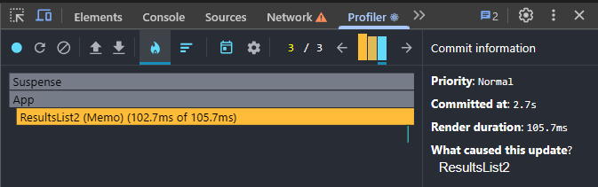
> Ranked Chart for year
> 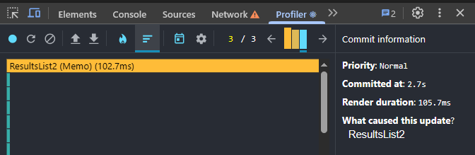

> ## Adding/removing columns:
>
> **Commit Duration:** 2.2s  
> **Render Duration:** 118.8ms  
> **Interactions:** Not recorded (Profiler did not capture explicit interactions, but commit and render times were analyzed instead)
>
> ### Screenshots:
>
> Flame Graph for columns
> 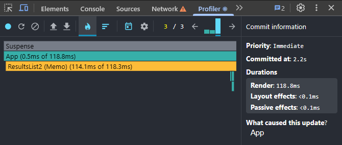
> Ranked Chart for columns
> 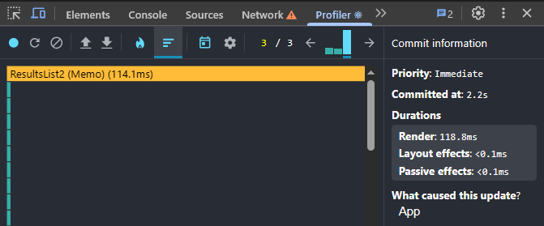

> ## Conclusion:
>
> Looks like optimization reduced commit durations for heavy interactions like sorting, selecting a year, and adding/removing columns, resulting in faster overall UI updates, while light actions like search remained largely unaffected.
